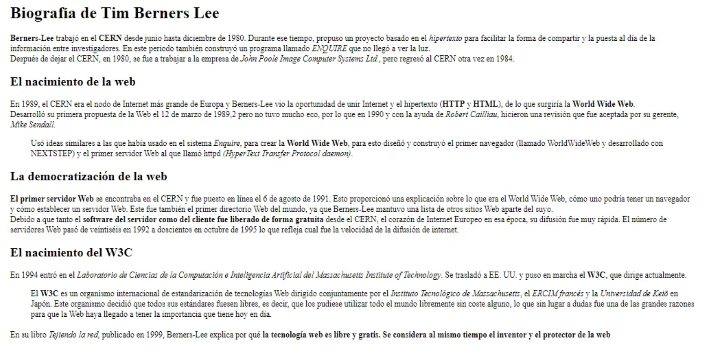
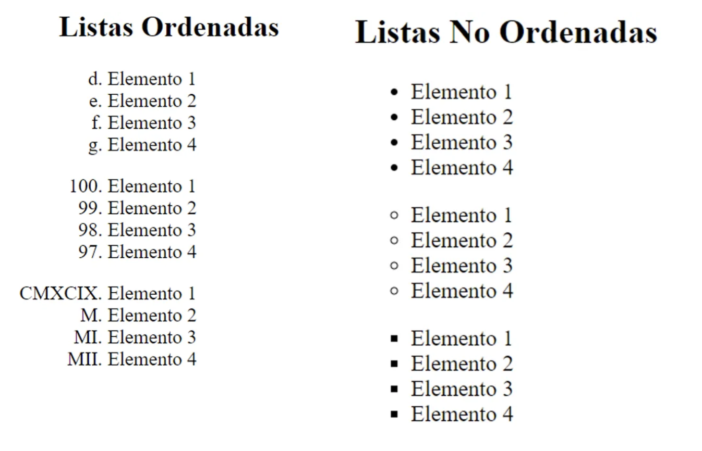

  

# BABY STEPS HTML 5

## 🏆 Objectives

- Introduction to using HTML5 tags.

## 🔧 Technical Skills

- Web layout and structure.

## 🛠️ Tools

- Visual Studio Code  
- HTML5

## 🪜 Instructions

### ✳️ 1. Text Manipulation

Recreate the following image using HTML5 and its semantic tags.

  

### ✳️ 2. Buttons

Add two buttons at the end of the text. One should contain a “like: 👍” icon and the other a “dislike: 👎” icon.  

Also, add a button labeled **"Exit"** that redirects to the [FemCoders F5 website](https://femcoders.org/).

### ✳️ 3. List Manipulation

Recreate the following lists using HTML5 and explore a bit of CSS3.

  

